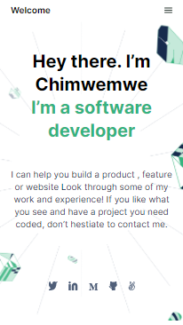

# MY PORTFOLIO

> This project was built for Microverse [under these guidance objectives](https://github.com/microverseinc/curriculum-html-css/blob/main/portfolio/1_setup.md) > _note: you can only access this link if you're a Micronault (Microverse Student)_

## Built With

- HTML
- CSS

## Authors

👤 **Chimwemwe Sinyinza**

- GitHub: [@Chimwemwe-127001](https://github.com/Chimwemwe-127001)
- Twitter: [@chimwewme](https://twitter.com/chimwewme)

## 🤝 Contributing

Contributions, issues, and feature requests are welcome!

Feel free to check the [issues page](../../issues/).

## Show your support

Give a ⭐️ if you like this project!
